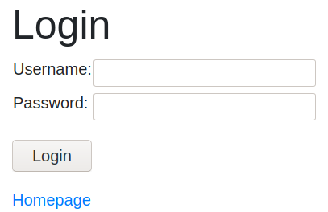
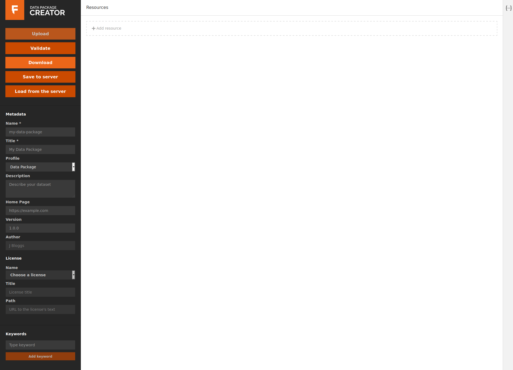
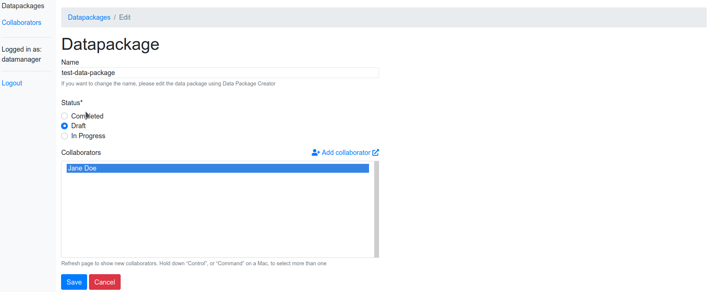
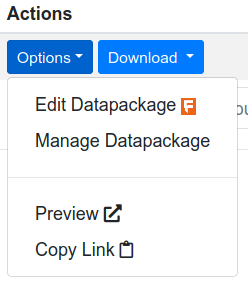

# schema-collaboration: documentation for data managers

## Introduction
schema-collaboration is a tool in the form of a web platform to help data managers and collaborators to work together to create Frictionless datapackages. A collaborator could be a researcher but in general can be anyone who is working on the dataset.

In order to use this application some familiarity with Frictionless Datapackages is required. You can find information on the [Frictionless website](https://frictionlessdata.io/) or in the [Data Package specification](https://specs.frictionlessdata.io/data-package/).

schema-collaboration uses [datacreator-ui](https://github.com/frictionlessdata/datapackage-ui): see the [datacreator-ui demo](https://create.frictionlessdata.io/).

It was funded by the Frictionless Data Tool Fund 2020. There is a [blog with the initial description of the project](https://frictionlessdata.io/blog/2020/07/16/tool-fund-polar-institute/#meet-carles-pina-estany).

## Overall steps to use schema-collaboration
The documentation gives detailed steps with screenshots about how to use schema-collaboration. The general ideas covered are:
 * Installing the application
 * Logging in as a data manager
 * Creating a Datapackage and adding the known information (title, authors, etc.)
 * Creating a Person
 * Editing the Datapackage and making the created person a collaborator of a particular Datapackage
 * Sending the Datapackage link to the collaborators so they can work on it
 * At any time adding comments to the datapackage to be seen either by the data manager only or by the collaborators as well

## Installation
schema-collaboration needs to be installed on a server in order to be used by the data manager and collaborators. It is written in Python and Django and there are different ways to set it up:
 * Using a Python virtual environment (see the documentation in the main README file)
 * Using Docker and an SQLite3 database
 * Using Docker and a MariaDB database server (this server is not bundled within the Docker image)

We have tried to make schema-collaboration easy to install locally (for evaluation purposes for example) without having to setup a full server and database. Someone with certain familiarity of the shell with either Docker or Python3 installed, should be able to install schema-collaboration on their computer to be used locally. If you have any problems though, please get in touch.

In order to install schema-collaboration on a server to be used in production, a system administrator will need to help to integrate with existing infrastructure (DNS, existing servers, virtual hosts, backups, existing database, etc.).

We have tried to make schema-collaboration easy to deploy. Do not hesitate to get in touch if you need anything implemented in schema-collaboration that would make deploying it easier and we will consider how we could make improvements.

schema-collaboration stores the Data package schemas but not research data, to keep the installation and administration of the application as easy as possible. This feature might be added in the future.

## User account types
There are three different roles within the application:
 
 * *Data manager users:* they have access to the "management" area with individual login and password. All data manager users have access to the same data sets. The login link is on the main page and the username and password are created during the installation;
 * *Admin user:* this user, using the Django admin web section, can do other actions that are not exposed to the data managers  such as adding or removing statuses of the data packages, deleting or modifying comments and deleting data packages;
 * *Collaborators:* they do not need any login/password. The data managers will send unique links to collaborators to give access to their datasets. The system is designed this way to avoid creating more users.

## Data manager login into schema-collaboration
After the installation of the schema-collaboration, on the main page there is a link to the management area. The URL of the schema-collaboration will vary depending on the installation methods but it will look something like:
 * [http://localhost:8000](http://localhost:8000) if it was installed on the local computer in port 8000 (default if following the instructions)
 * [https://schema-collaboration.yourinstitution.org](https://schema-collaboration.yourinstitution.org) (or similar) if it was installed on another server.

On the main page follow the link to the "management area":

|  |
|---|

Login using the data manager credentials:

|  |
|---| 

The username and password for the data manager were created during the installation. Please refer to the installation steps to find them.

## Navigation
There is a left-hand side bar to navigate between "Datapackages" and "People". It also shows the user that is logged-in (in the image below, the user is "datamanager") and allows that user to "Logout". See the options:

|  |
|---|

## Create the first datapackage
The first time that a data manager logs into the system there will be no data packages. The data manager needs to create a new data package and complete the basic information.

Select the button "Create a Datapackage" in order to create one:

|  |
|---|

This will create a new, empty, data package and it will open the Data Package Creator:

|  |
|---|

As a data manager, complete the information that you might already know about the data set.

At any point or when finished select "Save to server".

Navigate back to data package management interface, then select "List of datapackages" (TODO 2020-10-20: button to be added!), which will contain the new datapackage:

|  |
|---|

## Create the first Person
Select "People" on the left hand side bar to create the first collaborator:(TODO 2020-10-20 rename to collaborators?)

|  |
|---|

Select "Create a Person" and enter the person's name:

|  |
|---|

schema-collaboration will show the "Person detail" page:

|  |
|---|

There are three buttons in the screenshot above:
 * "Edit": to edit the person (change the name)
 * "List Datapackages": takes you to the list of datapackages assigned to this collaborator
 * "Copy List Datapackages": copies the link to the list of datapackages assigned to this collaborator, to your clipboard.
 
 If we open "List Datapackages" (for this user) it is currently empty:

|  |
|---|

Note that this page doesn't have the left-hand side bar. This is because the external pages (available to collaborators) do not have these options available and the URL can be sent to the collaborators in order to work on it.

## Assign a datapackage to a collaborator
Select "Datapackages" on the left-hand side and next to the relevant datapackage, select "Options -> Manage Datapackage":

|  |
|---|

There is some brief information in the datapackage detail. Here is where you could add Comments for the collaborators or just for the data manager (enable "Private" if the comment is only for the data manager).

Select "Edit Manage" in order to Manage the Datapackage:

|  |
|---|

On this page you are able to Edit this datapackage to change its status and add collaborators. In the example below we add the collaborator "Jane Doe" and selecting "Save".

After this step, select "Datapackages" again and in the "List of Datapackages", "Jane Doe" will appear as a "Collaborator".

|  |
|---|

## Options for a Datapackage
Each Datapackage has a set of options:

||
|---|

 * Edit Datapackage: takes you to the "Datapackage creator" in order to make changes to the data package
 * Manage Datapackage: place to add comments and also to edit the datapackage collaborators and status of the datapackage
 * Collaborator View: takes you to the page that is accessible without login/password, which can be sent to collaborators. Collaborators can read and write comments, see datapackage information, edit  and download the datapackage.

## Download button
The "Download" button appears in different pages always with the same options:

|  |
|---|

 * Schema: downloads the JSON schema file
 * Markdown: generates a documentation file formatted in Markdown, based on the Schema
 * PDF: generates a PDF file from the Markdown
 
All the Markdown and PDF information comes from the Schema.
 
An example of the PDF output:

## Collaborator access
The collaborators can have access to the datapackages via two type of links:
 * Datapackage link: give access to one datapackage
 * Collaborator link: all the datapackages for the collaborator will appear and the collaborator can choose which one to work on

The public link to a single datapackage can be found in the "Options" in the List of Datapackages.

The public link to all the datapackages for a given users can be found in the "List of People" and the name is "List Datapackages".

Collaborators don not need a username/password: the unique links are enough to access there.

## Admin access and operations
All the day-to-day operations can be done by the datamanagers in the management area. There available access to the Django standard "admin" panel to do some other operations like:
 * Create other datapackage status. By default "Draft", "In Progress" and "Completed" are created. You can modify these ones or add other status and will appear in the "Manage datapackage". For example "Published", "Waiting for Data", "Embargo", etc.
 * Delete datapackages (it is not possible yet in the management section but in the admin section it is possible)
 * Delete or modify comments
 * Delete people
 * Create other data manager users

To access the admin panel use an URL like [http://localhost:8000/admin](http://localhost:8000/admin) (change http://localhost:8000 as needed in your installation). Then you will need to enter the "Django administration" username and password. This is the `admin` user that got created when schema-collaboration was initially installed.

If you don't know the admin username and password anymore you can create/setup a new one using `python3 manage.py changepassword admin` (see [Django documentation for changing the password](https://docs.djangoproject.com/en/3.1/topics/auth/default/#changing-passwords) or [how to create another admin user](https://docs.djangoproject.com/en/3.1/topics/auth/default/#creating-superusers))

The admin section list of packages looks like:

|  |
|---|

### Create more Datapackage Status
On the left hand side select "Datapackage status" to list the Datapackage status:

|  |
|---|

Then on the "Add datapackage status" to load the form:

|  |
|---|

Enter the new data status name (in the example "Published") and select "Save".

"The Behaviour": currently there is only one possible "Behaviour": "Default on creation". The status of a new (just created), datapackage will be the status that has "Default on creation". Only one Status can have the Behaviour "Default on creation".

### Delete People
Select on "People" on the left hand side and fine the Person or People to be deleted. You can use the "Search" feature if needed. Select the checkboxes and then the action "Delete selected People":

|  |
|---|

If this person is a collaborator in some Datapackages it will be de-attached and you might need to confirm it select on "Yes, I'm sure":

|  |
|---|

These steps are the same for deleting a Datapackage or a Comment.

### Other operations
Other operations in the admin: just navigate on the left hand side to Comments and use it to modify, delete or add objects as needed.
